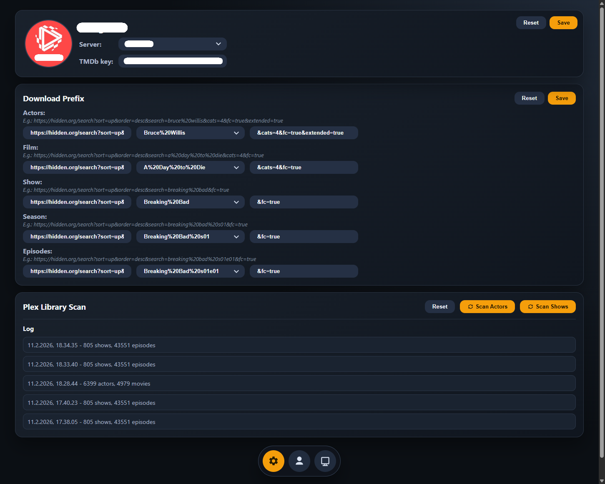
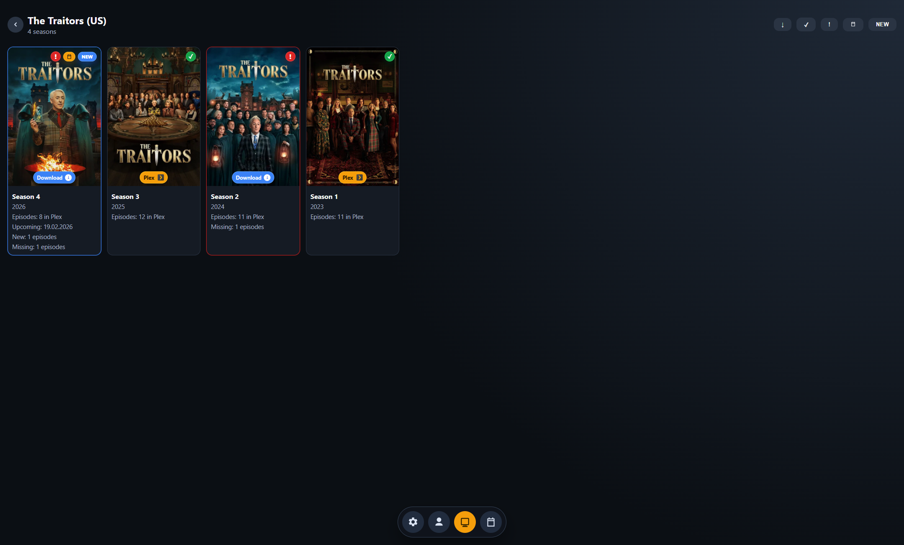
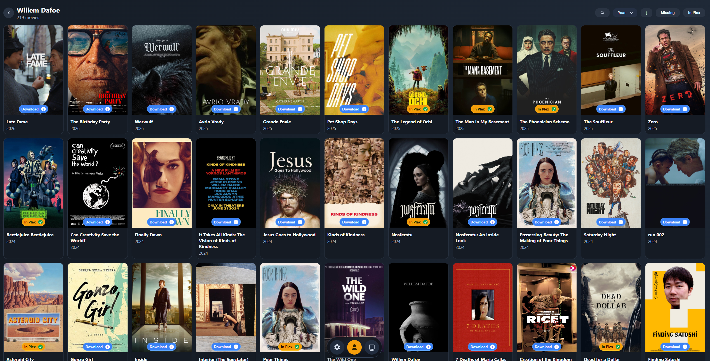
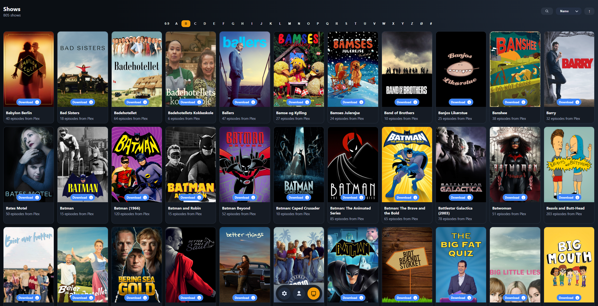

# Plex Collector

Localhost-only tool for comparing Plex library actors with TMDb movie credits to find missing movies.

## Features
- First-run onboarding with `Login with Plex`
- Profile page with Plex account/server details
- Floating icon-only bottom navigation (`Profile`, `Actors`, `Shows`)
- `Scan Actors` and `Scan Shows` with combined scan log
- Actors grid from Plex movie library
- Actor detail page with TMDb movie credits (`Missing` / `In Plex` filters)
- Shows grid from Plex TV library
- Show -> Season -> Episode flow with `Missing` / `In Plex` filters
- Download prefix settings for `Actors`, `Movies`, `Shows`, `Seasons`, and `Episodes`
- Clickable `In Plex` and `Download` badges on cards

## Screenshots






## Requirements
- Python 3.11+
- Plex account with access to a Plex server
- TMDb API key

## Install
Run first-time setup (creates `.venv` and installs dependencies):
```bat
Install.bat
```
`Install.bat` does not start the server.

## Start Server
Run after installation:
```bat
start_server.bat
```
Open `http://127.0.0.1:8787`.

## Notes
- Data is cached locally in `backend/data/plex_collector.db`.
- Use `Scan Actors` on the Profile page after login.
- This app prefers local Plex connections when available.
- `Install.bat` auto-creates or recreates `.venv` if it belongs to another machine/user.
