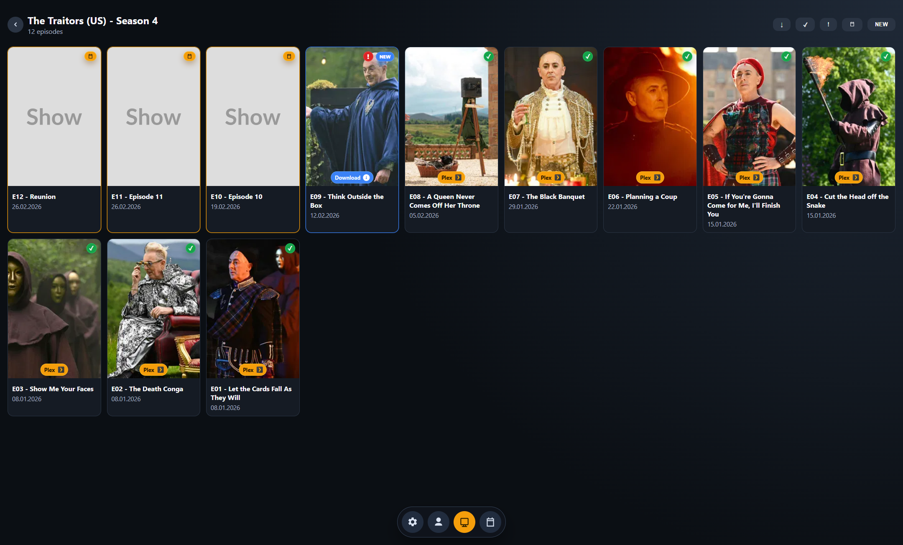

# Plex Collector

[](https://github.com/adultkips/Plex-collector/actions/workflows/security.yml)
[](https://github.com/adultkips/Plex-collector/actions/workflows/codeql.yml)
[](LICENSE)

Localhost-only tool for comparing Plex library actors with TMDb movie credits to find missing movies.

## Features
- First-run onboarding with `Login with Plex`-button.
- Profile page with Plex server details
- Floating icon-only bottom navigation
- `Scan Actors` and `Scan Shows` with combined scan log
- Actors grid from Plex movie library
- Actor page with TMDb movies grid (incl. `Missing` / `In Plex` filters)
- `Create Collection` in Plex from actor movie view.
- Shows grid from Plex shows library
- `Scan episodes` on Shows page.
- Show -> Season -> Episode flow with `Missing` / `In Plex` filters
- `Download Prefix` settings for `Actors`, `Movies`, `Shows`, `Seasons`, and `Episodes`
- Clickable `Plex` and `Download` badges on cards

## Screenshots
Profile View


Actors View


Movies View


Shows View


Seasons View


Episodes View


## Requirements
- Python 3.11+
- Plex account with access to a Plex server
- TMDb API key

## Install
Run first-time setup (creates `.venv` and installs dependencies):
```bat
Install.bat
```
`Install.bat` does not start the server.

## Start Server
Run after installation:
```bat
start_server.bat
```
Open `http://127.0.0.1:8787`.

## Notes
- Data is cached locally in `backend/data/plex_collector.db`.
- Use `Scan Actors` on the Profile page after login.
- This app prefers local Plex connections when available.
- `Install.bat` auto-creates or recreates `.venv` if it belongs to another machine/user.

## Security
- See `SECURITY.md` for vulnerability reporting.
- Dependency vulnerability checks run in GitHub Actions (`.github/workflows/security.yml`).
- Static code scanning runs via CodeQL (`.github/workflows/codeql.yml`).

## Contributing
- See `CONTRIBUTING.md`.

