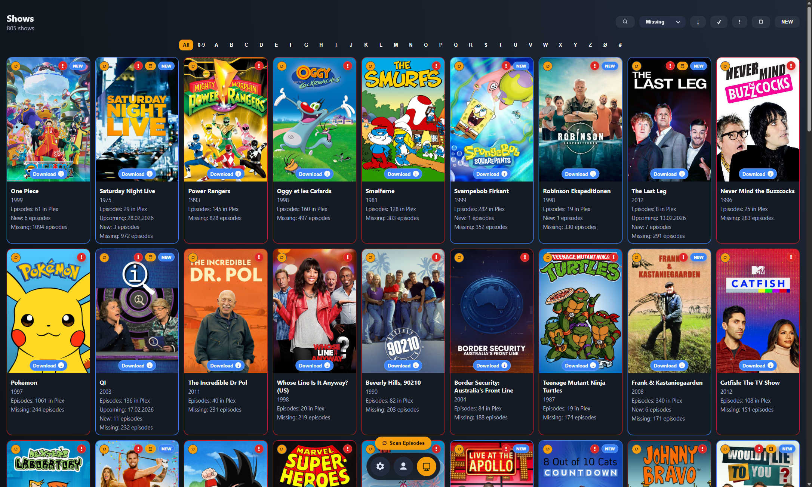
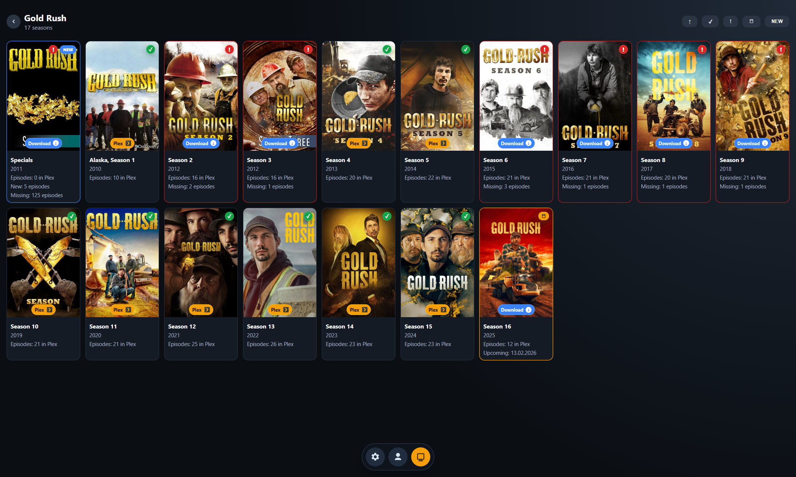
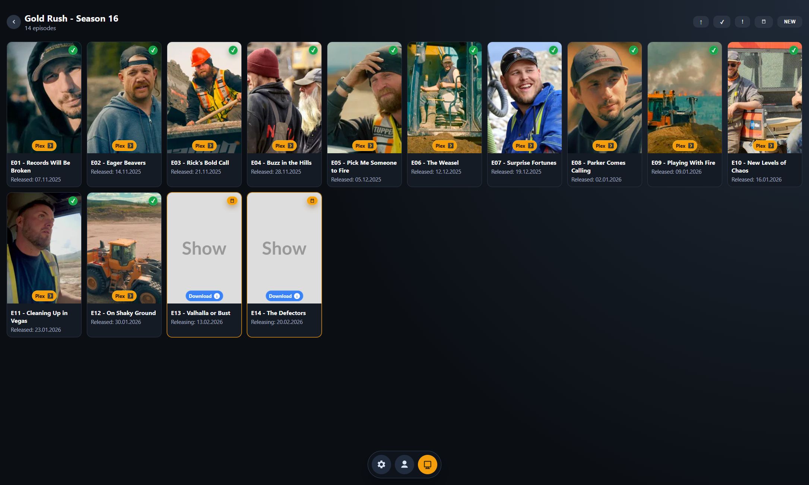

# Plex Collector

[](https://github.com/adultkips/Plex-collector/actions/workflows/security.yml)
[](https://github.com/adultkips/Plex-collector/actions/workflows/codeql.yml)
[](LICENSE)

Localhost-only Plex companion for scanning movies and shows, matching with TMDb, and surfacing missing content.

## Features
- First-run onboarding flow with `Login with Plex`, Plex server selection, and TMDb API key setup.
- Localhost-only architecture: all scans, matching, and state are handled locally on your machine.
- Profile hub with centralized settings (`Server`, `TMDb key`, `Download Prefix`).
- Floating icon-only bottom navigation `Profile`, `Actors`, and `Shows`.
- Download Prefix system:
  - Configurable start/format/end templates for `Actors`, `Movies`, `Shows`, `Seasons`, and `Episodes`.
  - Multiple keyword formats supported (`%20`, `-`, `+`) with live examples.
  - Prefix reset/save controls at card level.
- Combined Plex library scanning:
  - `Scan Actors` to index actors and movie links.
  - `Scan Shows` to index shows, seasons, and episodes.
  - Unified scan log with latest runs first.
- Actors experience:
  - Large poster grid sourced from Plex.
  - A-Z/All filtering and live search.
  - Filters for `In Plex`, `Missing`, `Upcoming`, and `NEW`.
  - Sorting by `Movies`, `Missing`, `Name`, `New`, and `Upcoming` with ASC/DESC direction.
  - Global `Scan Movies` modal with scoped scan (`current filter`) or `Scan All`.
  - Per-actor scan pill with last-scan date and quick refresh.
  - Visual status badges and borders for `In Plex`, `Missing`, `Upcoming` and `NEW`.
  - Direct actor download badge support via configurable prefix links.
- Actor movie detail:
  - Large poster grid sourced from Plex.
  - TMDb filmography matching against Plex library.
  - Filters for `In Plex`, `Missing`, `Upcoming`, and `NEW`.
  - Sorting by `Date`, `Title`, `Missing`, `New`, and `Upcoming` with ASC/DESC direction.
  - Clickable TMDb movie cards and Plex/deep-link badges.
  - Visual status badges and borders for `In Plex`, `Missing`, `Upcoming` and `NEW`.
  - Direct movie download badge support via configurable prefix links.
  - `Create Collection` action to build/update Plex collections from in-library matches.
- Shows experience:
  - Large poster grid sourced from Plex.
  - A-Z/All filtering and live search.
  - Filters for `In Plex`, `Missing`, `Upcoming`, and `NEW`.
  - Sorting by `Date`, `Episodes`, `Missing`, `Name`, `New`, and `Upcoming` with ASC/DESC direction.
  - Global `Scan Episodes` modal with scoped scan (`current filter`) or `Scan All`.
  - Per-show episode scan pill with last-scan date and quick refresh.
  - Visual status badges and borders for `In Plex`, `Missing`, `Upcoming` and `NEW`.
  - Direct show download badge support via configurable prefix links.
- Seasons and episodes drill-down:
  - Show -> Season -> Episode navigation.
  - Filters for `In Plex`, `Missing`, `Upcoming`, and `NEW` with ASC/DESC direction.
  - Visual status badges and borders for `In Plex`, `Missing`, `Upcoming` and `NEW`.
  - Direct season or episode download badge support via configurable prefix links.

## Screenshots
<table>
  <tr>
    <td align="center"><br><sub>Profile</sub></td>
    <td align="center"><br><sub>Actors</sub></td>
    <td align="center"><br><sub>Movies</sub></td>
  </tr>
  <tr>
    <td align="center"><br><sub>Shows</sub></td>
    <td align="center"><br><sub>Seasons</sub></td>
    <td align="center"><br><sub>Episodes</sub></td>
  </tr>
</table>

## Requirements
- Python 3.11+
- Plex account with access to a Plex server (local network reachable)
- TMDb API key
- Windows environment for the included launcher scripts (`Install.bat`, `start_server.bat`)

## Install
Run first-time setup (creates `.venv` and installs dependencies):
```bat
Install.bat
```
`Install.bat` does not start the server.

## Start Server
Run after installation:
```bat
start_server.bat
```
Open `http://127.0.0.1:8787`.

## Notes
- The app is designed for local use on `127.0.0.1` and stores app state in `backend/data/plex_collector.db`.
- Use the Profile page to run `Scan Actors` and `Scan Shows`, then use `Scan Episodes` from the Shows page when needed.
- UI performance is cache-first: Profile, Actors, and Shows render from local cache and refresh in the background.
- Image cache is invalidated automatically after scans/resets to avoid stale posters.
- `Install.bat` creates or recreates `.venv` if it belongs to another machine/user, and `start_server.bat` is used for normal startup.

## Security
- See `SECURITY.md` for vulnerability reporting.
- Keep API keys and tokens out of git; use local `.env` only (never commit secrets).
- Treat `backend/data/plex_collector.db` as sensitive local data (it can contain account/session related app data).
- Run this app on trusted local networks and avoid exposing the local server publicly.
- Dependency vulnerability checks run in GitHub Actions (`.github/workflows/security.yml`).
- Static code scanning runs via CodeQL (`.github/workflows/codeql.yml`).

## Contributing
- See `CONTRIBUTING.md` for workflow and conventions.
- Open an issue before large feature changes to align scope and UX direction.
- Keep PRs focused and include:
  - what changed
  - why it changed
  - how it was tested
- Update README/screenshots when user-facing behavior changes.


